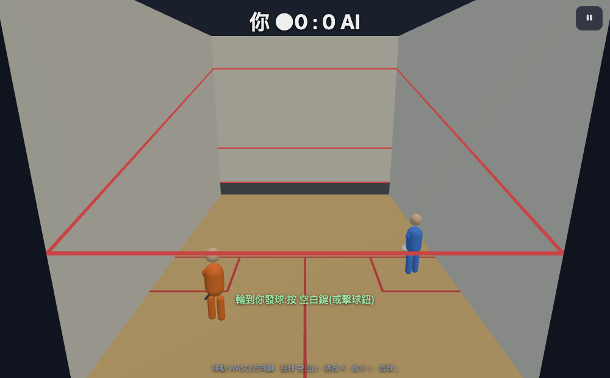

# Pixel Squash

A browser squash game — **TypeScript + Three.js**, with a deterministic SI-unit
physics core. You play (blue) against an AI (orange) on a real squash court: the ball
lives in a true 3D box (`x` across, `y` depth-from-front-wall, `z` height) rendered as
an actual third-person 3D scene, not a projected 2D fake.



The engine is a deterministic pure function (`stepGame`) at a fixed 60 Hz — no
`Math.random` / `Date`, immutable state, single mulberry32 PRNG seeded per match. The
game, the replay viewer, and all five test layers run the **same** `stepGame` path, so
what the tests exercise is exactly what you play.

Forked from [pixel-badminton](https://github.com/yanchen184/pixel-badminton): kept the
deterministic-sim / input-seam skeleton, rewrote the physics (4-wall bounce instead of a
net), shot set, scoring, projection — and in v2 moved the physics into `src/engine/` and
replaced the renderer with real Three.js 3D.

## Quick start

```bash
npm install
npm run dev        # Vite dev server (http://localhost:5180)
```

Play online: **[pixel-squash.web.app](https://pixel-squash.web.app)** ·
Watch an AI-vs-AI replay:
[/replay.html](https://pixel-squash.web.app/replay.html?seed=20260707&a=strong&b=weak&rallies=6&autoplay=1) ·
Live status board: **[html.yanchen.app/pixel-squash](https://html.yanchen.app/pixel-squash/)**

| Script | What it does |
|---|---|
| `npm run dev` | Vite dev server |
| `npm run build` | `tsc -b && vite build` |
| `npm run typecheck` | `tsc -b --noEmit` |
| `npm test` | Vitest unit + physics + engine suite (24 files, 225 tests) |
| `npm run e2e` | Playwright E2E (headed — RAF freezes in hidden tabs; 5 files, 14 tests) |

## Modes

- **Match** — you vs AI, PAR-11 (first to 11, win by 2). Every rally ends with a death
  reason (tin / out / double-bounce).
- **Career ladder (M2)** — an 8-rung named ladder of bot personalities, reaction speed
  increasing monotonically up the rungs. Win to unlock the next rung; progress saved to
  `localStorage`.

  > 阿新 → 長城 → 小刀 → 重砲 → 節拍器 → 獵犬 → 老狐狸 → **修羅**

- **Daily challenge (M3)** — the date seeds the opponent, so everyone worldwide plays the
  same bot that day (UTC-aligned). Local best record (win > point-diff > time), plus a
  shareable AI-exhibition replay: send the URL, your friend watches the identical match.
- **Tutorial (M4)** — an interactive 5-step onboarding (move → serve → return → timing →
  shot select); each step advances only once you actually do it.

## How to play

Left hand moves, right hand swings. The shot you pick sets the depth/height — there is
**no charge meter**; power comes purely from **swing-timing quality** (PERFECT / GOOD /
OK, judged on when you swing as the ball rises).

| Input | Action |
|---|---|
| `W A S D` / arrows | Move (up = toward the front wall) |
| `Space` / `J` | Drive — the straight rail, safe default |
| `K` | Lob — float high to the back corners (the reset) |
| `L` | Drop — feathered touch into the front corner |
| `;` | Kill — flat hard rail just above the tin |
| Any shot key (on serve) | Serve when it is your turn |
| `Esc` | Pause (resume / volume / quit to menu) |

Illegal shots auto-downgrade (a kill on a low ball falls back to a shovel that keeps the
ball alive). On touch devices a left-half virtual joystick + right-side shot buttons
mirror the keyboard (auto-hidden on desktop, and only shown in-match).

Scoring is PAR-11, win by 2. The ball dies on a tin strike (front wall below the tin) or
a second floor bounce.

## Architecture

```
src/
  engine/        deterministic SI-unit core (stepGame, physics, shots, bots,
                 ladder, daily, quality) — only +−×÷ sqrt imul allowed here,
                 no Date / Math.random (enforced by a vitest determinism lint)
  game3d/        Three.js render + game shell: main loop, Render3D, input
                 (keyboard + touch), audio (procedural WebAudio), settings,
                 tutorial — allowed Date / Math.random / localStorage
```

The engine is the source of truth; `game3d/` is a thin render/UX shell that never owns
game logic. Randomness enters only through `createPrng(seed)`; hashes chain FNV-1a so a
whole match collapses to one number you can eyeball against a blessed value.

See **[PLAN.md](./PLAN.md)** for the full engine spec — every physics constant,
coordinate system, scoring rule, and the test plan.

## Testing — a five-layer pyramid

Game *feel* has no oracle, so correctness is split across five layers (detail in
PLAN.md; live numbers on the [status board](https://html.yanchen.app/pixel-squash/)):

- **L1 — invariants**: ball always in-bounds, no NaN, energy never grows, same seed →
  same per-tick hash. Plus a static determinism lint over `src/engine/`.
- **L2 — reality anchors**: free-fall time, wall-bounce retention, drive speed anchored
  to real squash numbers — catches "self-consistent but not squash".
- **L3 — rules matrix**: PAR-11 scoring / hand-out / match point, serve legality, death
  attribution; plus unit tests for M1 swing quality, M2 ladder, M3 daily, M4 tutorial.
- **L4 — proxy-metric corridors**: bot self-play over hundreds of rallies, fencing rally
  length, return rate, winner:error ratio, shot diversity, left/right fairness, and the
  ladder's difficulty gradient inside sane bands.
- **L5 — golden-replay blessing**: human-approved replays frozen to seed + hash. Touch
  the feel and the hash changes → CI goes red → someone re-watches and re-blesses.

Run: `npm test` (24 files, 225 tests) + `npm run e2e` (5 files, 14 tests).

## Deploy

Pushing to `master` / `main` triggers GitHub Actions
(`.github/workflows/deploy.yml`): typecheck → test → build → Firebase Hosting
(`pixel-squash`).
